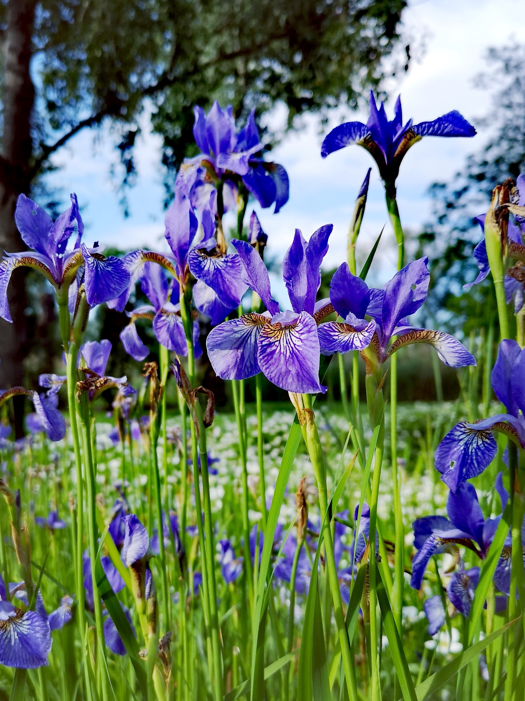

# Iris Dataset Project 2020




## Fisher’s Iris Dataset
Introduced by British statistician and biologist Ronald Fisher in his 1936 paper entitled “The use of multiple measurements in taxonomic problems”. It is an example of linear discriminate analysis.
The dataset gives the measurements in centimetres of the sepal length and width and petal length and width of 50 flowers from each species of iris: setosa, versicolor, and virginica.
The dataset contains a set of 150 records of 5 attributes:
Sepal length in cm
Sepal width in cm
Petal length in cm
Petal width in cm
Species of iris: setosa, versicolor, virginica [1,2]

## Libraries Used
```
import pandas as pd
import numpy as np
import seaborn as sns
import sys
```

- **Pandas** - an open source, BSD-licensed library providing high-performance, easy-to-use data structures and data analysis tools. [2]
- **Numpy** – the fundamental package for scientific computing with Python [2]
- **Seaborn** – a Python visualization library based on matplotlib. It provides a high-level interface for drawing attractive statistical graphics. [2]
- **Sys** - System-specific parameters and functions.
This module provides access to some variables used or maintained by the interpreter and to functions that interact strongly with the interpreter. It is always available. [20]


## Importing the Data
Downloading the Iris dataset from the internet using the panda and sys libraries which will enable me to analyse the first few rows of data.

```
#Downloaded iris dataset from https://tinyurl.com/y8fovkyq

sys.stdout = open("variables_summary.txt", "w")

iris_data = pd.read_csv('tableconvert_csv_xin5ac.csv')

iris_data.columns = ['sepal_length', 'sepal_width' , 'petal_length', 'petal_width', 'variety']

iris_data.head(10)

iris_data.shape
#print(iris_data)
```

## Investigating the Data: Finding the Min, Max, Mean, and Standard Deviation
```
#Get the minimum value of all the columns
print("\nMinimum")
print(iris_data.min())

#Get the maximum value of all the columns
print("\nMaximum")
print(iris_data.max())

#Get the mean value of all the columns
print("\nMean")
print(iris_data.mean())

#Get the median value of all the columns
print("\nMedian")
print(iris_data.median())

#Get the standard deviation of all the columns
print("\nStandard Deviation")
print(iris_data.std())

print(iris_data['variety'].unique())
```


```
Minimum
sepal_length       4.3
sepal_width          2
petal_length         1
petal_width        0.1
variety         Setosa
dtype: object
```

```
Maximum
sepal_length          7.9
sepal_width           4.4
petal_length          6.9
petal_width           2.5
variety         Virginica
dtype: object
```

```
Mean
sepal_length    5.843333
sepal_width     3.057333
petal_length    3.758000
petal_width     1.199333
dtype: float64
```

```
Median
sepal_length    5.80
sepal_width     3.00
petal_length    4.35
petal_width     1.30
dtype: float64
```

```
Standard Deviation
sepal_length    0.828066
sepal_width     0.435866
petal_length    1.765298
petal_width     0.762238
dtype: float64
```

## Summary Chart (or a much nicer view of the min, max, mean, std dev)
```
#Gathered a summary of the data (count, mean, std deviation, minumin, 25%, 50%, 75%, maximum)
#Used call chaining to make code look pretty.

summary = iris_data.describe().transpose().head()
print(summary)

sys.stdout.close()
```
```
['Setosa' 'Versicolor' 'Virginica']
              count      mean       std  min  25%   50%  75%  max
sepal_length  150.0  5.843333  0.828066  4.3  5.1  5.80  6.4  7.9
sepal_width   150.0  3.057333  0.435866  2.0  2.8  3.00  3.3  4.4
petal_length  150.0  3.758000  1.765298  1.0  1.6  4.35  5.1  6.9
petal_width   150.0  1.199333  0.762238  0.1  0.3  1.30  1.8  2.5
```

## Analysis:
Judging from the above chart, we can see a big range between sepal length and petal length. Next, we will see if this range is determined by the species of iris.


## Boxplots
Boxplots are useful because they offer a quick and visually pleasing way to compare data [2][11].
In this case, I have four separate boxplots comparing the distributions across the variables and varieties of iris. First, I compare the sepal length, then sepal width, then the petal length and then, finally, the petal width for each species: Setosa, Versicolor, Virginica
```
import seaborn as sns
import matplotlib.pyplot as plt
sns.set(style="whitegrid", palette="BuGn_r", rc={'figure.figsize':(11.7,8.27)})

title="Compare Distributions of Sepal Length"

sns.boxplot(x="variety", y="sepal_length", data=iris_data)
```

 


```
import seaborn as sns
import matplotlib.pyplot as plt

sns.set(style="whitegrid", palette="BuGn_r", rc={'figure.figsize':(11.7,8.27)})

title="Compare Distributions of Sepal Width"

sns.boxplot(x="species", y="sepal_width", data=iris_data)
```


 ```
import seaborn as sns
import matplotlib.pyplot as plt

sns.set(style="whitegrid", palette="BuGn_r", rc={'figure.figsize':(11.7,8.27)})

title="Compare Distributions of Petal Length"

sns.boxplot(x="variety", y="petal_length", data=iris_data)
```


 ```
import seaborn as sns
import matplotlib.pyplot as plt

sns.set(style="whitegrid", palette="BuGn_r", rc={'figure.figsize':(11.7,8.27)})

title="Compare Distributions of Petal Width"

sns.boxplot(x="variety", y="petal_width", data=iris_data)
```


 
## Scatterplots
With scatterplots we can use variables to show that there is distinct difference in sizes between the species. 
```
from bokeh.plotting import figure, output_file, show
output_file("test1.html")

color1 = '#FF1493'
color2 = '#9400D3'
color3 = '#008080'
    
#Adding colours
colormap = {'Setosa': color1, 'Versicolor': color2, 'Virginica': color3}
colors = [colormap[x] for x in iris_data['variety']]

#Comparing Petal Width and Petal Length across all three species
p = figure(title = "Petal Width and Petal Length")
p.xaxis.axis_label = 'Petal Length'
p.yaxis.axis_label = 'Petal Width'
p.legend.location = "top_left"

p.diamond(iris_data["petal_length"], iris_data["petal_width"],color=colors, fill_alpha=0.2, size=10)

show(p)

#Comparing Sepal Width and Sepal Length across all three species
from bokeh.plotting import figure, output_file, show
output_file("test2.html")

#adding colors
colormap = {'Setosa': color1, 'Versicolor': color2, 'Virginica': color3}
colors = [colormap[x] for x in iris_data['variety']]

#adding labels
p = figure(title = "Sepal Width and Sepal Length")
p.xaxis.axis_label = 'Sepal Length'
p.yaxis.axis_label = 'Sepal Width'

p.circle(iris_data["sepal_length"], iris_data["sepal_width"],
         color=colors, fill_alpha=0.2, size=10)

show(p)
```


 
 

## Analysis: 
In the scatterplots we can see that the iris Setosa is clearly the smallest flower in terms of both sepal length and width and petal length and width. Iris Virginica, as we can see in the scatterplots, is the largest.


## Pairplot
I decided to use a pairplot here because it “creates a matrix of axes and shows the relationship for each pair of columns in a data frame. By default, it also draws the univariate distribution of each variable on the diagonal axis”[12].
This way, we have all the data points available to us in one place to analyse.
```
import seaborn as sns
import matplotlib.pyplot as plt

sns.pairplot(iris_data, hue="variety", palette="GnBu_d", markers=["o", "s", "D"])

plt.show()
 ```

 
 
## Final thoughts and conclusions
This was an interesting project on a few levels.
First, it was a great way to use some cool analysis tools using Python and various libraries within Python. I feel like I have a much better idea of how to utilise this coding language in order to gather and manipulate data. I particularly like using Matplotlib and Seaborn because it enables me to create different types of visual data representation to better see the dataset I’m working with, and it’s a lot more interesting to look at a nice, colourful chart than rows of numbers.
Second, I’ve learned more about irises than I ever thought I would. The Setosa iris is native to a few places around the world, including places like Alaska, Russia, Canada, Northeastern U.S., Northeastern Asia, and Japan. They’re a fairly hardy breed of iris, but they do need a period of cold weather, and wouldn’t do well in warmer climates. Probably not the best breed for Ireland [21].
The versicolor iris is native to the Eastern U.S. and Eastern Canada, but it also thrives in Britain and Ireland. Apparently it has ben used as a ‘magical’ plant for good luck. Unfortunately, this species of iris has also been known to poison animals and people who have consumed its rhizomes and its sap can cause dermatitis. I’m pretty sure these are the irises I have at my house. I’d recommend this variety to put in a planter, but keep pets away from them [22].
Finally, the virginica iris is native to the Eastern U.S. While this is the largest plant in terms of both sepal length and width and petal length and width, I find it to be the least attractive of all the species. What is interesting about the virginica though, is that it has been used as a medicinal plant by the Cherokee and Seminole tribes for various ailments [23].
Lastly, I found this project interesting because there are so many other projects that people have done using this same dataset. Some people have gone on to use machine learning to analyse the data [2], while others have simply done what I’ve done and gathered ad created visualisations of the data to analyse the relationships between the variables (sepal length/width, and petal length/width) [24]. It’s amazing how many open projects there are available freely on the internet concerning this dataset. I wonder if Fisher predicted that his dataset experiment would become such a prolific teaching tool for future data analytics students.


## References:
1.	https://en.wikipedia.org/wiki/Iris_flower_data_set
2.	https://github.com/RitRa/Project2018-iris/blob/master/Project%2B2018%2B-%2BFishers%2BIris%2Bdata%2Bset%2Banalysis.ipynb
3.	https://tableconvert.com/?output=csv&data=https://gist.github.com/netj/8836201/raw/6f9306ad21398ea43cba4f7d537619d0e07d5ae3/iris.csv
4.	https://realpython.com/python-csv/
5.	https://stackoverflow.com/questions/1526607/extracting-data-from-a-csv-file-in-python
6.	https://pandas.pydata.org/pandas-docs/stable/reference/api/pandas.read_csv.html#pandas.read_csv
7.	https://www.w3schools.com/python/numpy_intro.asp
8.	https://seaborn.pydata.org/generated/seaborn.boxplot.html
9.	https://seaborn.pydata.org/tutorial/color_palettes.html
10.	https://github.com/adam-p/markdown-here/wiki/Markdown-Cheatsheet
11.	https://seaborn.pydata.org/generated/seaborn.scatterplot.html
12.	https://seaborn.pydata.org/tutorial/distributions.html
13.	https://docs.bokeh.org/en/latest/docs/reference/plotting.html
14.	https://docs.bokeh.org/en/latest/docs/reference/colors.html
15.	https://www.w3schools.com/colors/colors_groups.asp
16.	https://www.kaggle.com/abhishekkrg/python-iris-data-visualization-and-explanation/data
17.	https://stackoverflow.com/questions/7152762/how-to-redirect-print-output-to-a-file-using-python
18.	https://kite.com/python/answers/how-to-redirect-print-output-to-a-text-file-in-python
19.	https://unsplash.com/photos/gK6f8bKKic0
20.	https://docs.python.org/3/library/sys.html
21.	https://en.wikipedia.org/wiki/Iris_setosa
22.	https://en.wikipedia.org/wiki/Iris_versicolor
23.	https://en.wikipedia.org/wiki/Iris_virginica
24.	https://github.com/vwalsh86/Iris-Data-Set-Project


